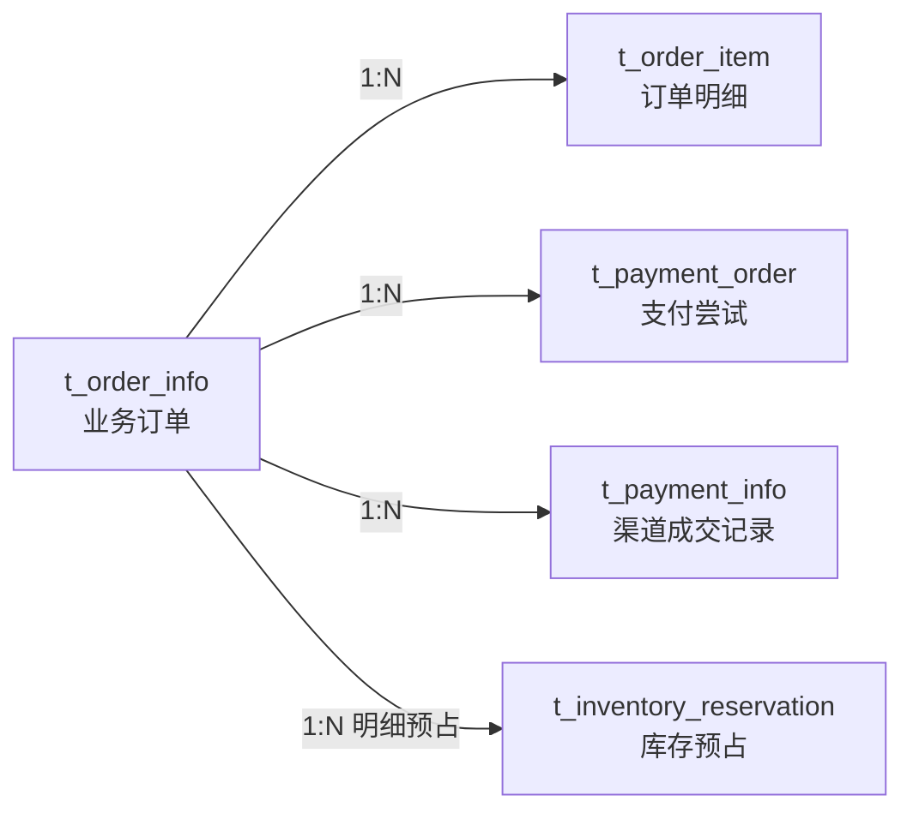
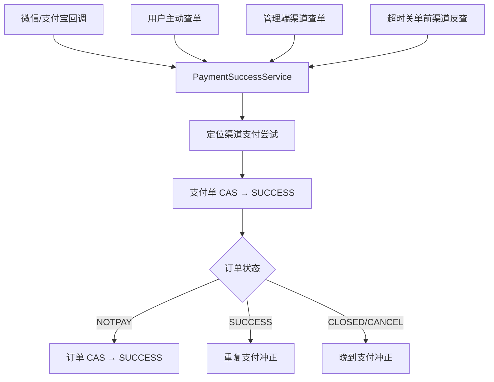
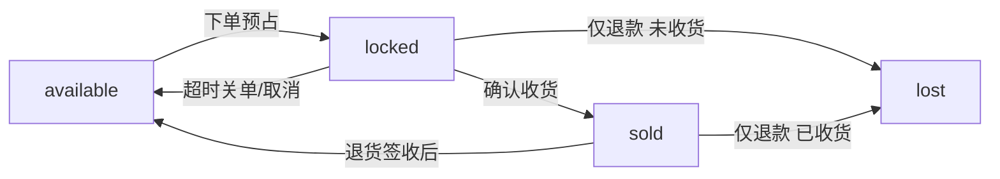
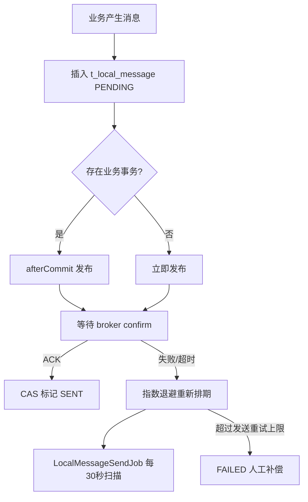

# CODE_INTRO — 电商商城平台代码导览

> 面向开发者的架构说明。启动方式、环境要求和常用命令见 [README.md](README.md)；修改规则见 [AGENTS.md](AGENTS.md)。

## 1. 系统定位

本项目是一个强调交易正确性的电商商城系统，完整覆盖：

```text
商品
→ 购物车
→ 结算下单
→ 库存预占
→ 微信/支付宝支付
→ 发货与物流
→ 确认收货
→ 退款/退货
→ 账单对账
```

后端：

```text
Spring Boot 2.3.7.RELEASE
Java 8
MyBatis-Plus 3.3.1
达梦 DM8
Redis + Redisson
RabbitMQ
MinIO（可选）
```

前端：

```text
user-ui   React 18 + Vite 5 + Ant Design 5
admin-ui  React 18 + Vite 5 + Ant Design 5 + SheetJS + Luckysheet
```

核心设计目标不是“所有操作强行放进一个大事务”，而是按一致性边界拆分：

- 数据库内关键状态：本地事务 + CAS。
- 并发串行化：Redisson 分布式锁。
- 库存：四桶模型 + 条件 UPDATE + 流水 + `biz_no`。
- 跨事务消息：Transactional Outbox + publisher confirm。
- MQ 消费：AUTO ACK + Spring Retry + Failure DLQ。
- MQ 故障后的业务收敛：DB Scheduler。
- 支付异常：渠道查询 + 重复/晚到支付冲正。

## 2. 仓库结构

```text
mall/
├── backend/
│   ├── src/main/java/cc/ivera/
│   │   ├── shared/
│   │   ├── product/
│   │   ├── order/
│   │   ├── payment/
│   │   ├── refund/
│   │   ├── user/
│   │   ├── cart/
│   │   └── bill/
│   ├── src/main/resources/
│   │   ├── application.yml
│   │   └── mapper/
│   ├── src/test/java/
│   ├── docs/
│   └── env/
│       ├── docker-compose.dm8.yml
│       └── sql/dm8/schema.sql
├── user-ui/
├── admin-ui/
├── AGENTS.md
├── CODE_INTRO.md
└── README.md
```

## 3. DDD 包结构

后端按 8 个限界上下文拆分，每个上下文统一使用：

```text
cc.ivera.<context>/
├── interfaces/
│   ├── Controller
│   ├── DTO / VO
│   ├── mq/Consumer
│   └── job/Scheduler
├── application/
│   ├── 应用服务接口
│   └── impl/
├── domain/
│   ├── model
│   ├── enums
│   ├── policy
│   ├── repository
│   └── gateway
└── infrastructure/
    ├── persistence/
    │   ├── po
    │   ├── mapper
    │   ├── converter
    │   └── repository
    ├── mq / config
    ├── redis
    ├── gateway
    └── 外部渠道/存储适配
```

### 3.1 上下文职责

| 上下文 | 主要职责 |
|---|---|
| `shared` | 公共响应/异常、认证基础设施、分布式锁、Outbox、RabbitMQ 公共可靠性配置 |
| `product` | 商品、库存四桶、库存预占、库存流水、Excel 库存导入、文件存储 |
| `order` | 结算、订单、订单明细、关单、发货、物流、确认收货 |
| `payment` | 支付单、支付记录、微信 V2/V3、支付宝、支付渠道/应用配置 |
| `refund` | 退款申请、退款单/明细、RefundPolicy、防超退、渠道退款与退款状态同步 |
| `user` | 用户、认证、登录保护、密码重置、收货地址、行政区划 |
| `cart` | Redis 购物车 |
| `bill` | 微信账单 CSV 解析、导入、支付/退款对账、差异处理 |

### 3.2 依赖方向

约束：

```text
interfaces → application → domain
                    ↑
infrastructure ─────┘
```

跨上下文协作只允许：

- 引用对方 application 服务接口；或
- 引用对方 domain model / repository / gateway 端口。

禁止：

```text
order → product.infrastructure.mapper
bill  → payment.infrastructure.po
refund → order.infrastructure.repository.impl
```

PO 属于数据库适配层，不是跨领域数据契约。

## 4. 核心数据模型

统一脚本 `backend/env/sql/dm8/schema.sql` 当前创建 22 张表。

| 表 | 说明 |
|---|---|
| `t_product` | 商品、价格、四桶库存 |
| `t_order_info` | 主订单、legacy 状态与多维状态 |
| `t_order_item` | 订单明细和商品快照 |
| `t_payment_order` | 本地支付尝试单 |
| `t_payment_info` | 渠道成交支付记录 |
| `t_payment_channel` | 微信/支付宝渠道配置 |
| `t_payment_app` | 渠道下应用配置 |
| `t_inventory_reservation` | 订单库存预占记录 |
| `t_inventory_transaction` | 库存四桶变化流水 |
| `t_order_shipment` | 发货与物流记录 |
| `t_refund_order` | 退款业务单 |
| `t_refund_item` | 退款明细 |
| `t_refund_info` | 渠道退款记录 |
| `t_stock_import` | Excel 库存导入记录 |
| `t_bill_import` | 对账导入批次 |
| `t_bill_record` | 渠道账单流水 |
| `t_bill_reconcile_discrepancy` | 对账差异 |
| `t_local_message` | Transactional Outbox |
| `t_user` | 用户 |
| `t_password_reset_request` | 密码重置申请 |
| `t_region` | 三级行政区划 |
| `t_shipping_address` | 用户收货地址 |

## 5. 订单与支付模型

### 5.1 单据关系



一个业务订单允许多个支付尝试，但只有一笔真正成交。

### 5.2 支付尝试规则

`t_payment_order` 用于描述“尝试支付”，和最终 `t_payment_info` 区分：

```text
CREATED → PAYING → SUCCESS
                  ↘ CLOSED
```

规则：

- 同订单可有多次支付尝试。
- 同渠道优先复用活跃支付单。
- 跨渠道可各自存在支付尝试。
- 支付成功 CAS 只允许首个有效成交获胜。
- 首笔成功后关闭其它活跃支付尝试。
- 已成交订单再次收到另一笔真实支付：自动冲正。
- 已关闭/取消订单收到晚到支付：自动冲正。

### 5.3 支付成功统一入口

关键组件：

```text
payment.application.PaymentSuccessService
```

多种触发源最终汇入统一支付成功逻辑：



## 6. 库存模型

### 6.1 四桶恒等式

```text
available_stock + locked_stock + sold_stock + lost_stock = 入库总量
```

| 桶 | 含义 |
|---|---|
| `available_stock` | 可售库存 |
| `locked_stock` | 已被订单占用但尚未最终结转 |
| `sold_stock` | 用户已确认收货的已售库存 |
| `lost_stock` | 不回仓、不可再次销售的货损库存 |

### 6.2 订单库存流转



支付成功本身不做 `locked → sold`：

```text
InventoryReservation: LOCKED → COMMITTED
库存桶数量：不变
```

这样在“已支付但未收货”阶段仍可清晰区分货权状态。

### 6.3 防超卖

核心 SQL 思路：

```sql
UPDATE t_product
SET available_stock = available_stock - ?,
    locked_stock = locked_stock + ?
WHERE id = ?
  AND available_stock >= ?
```

受影响行数为 0 即库存不足，整个下单事务失败。

### 6.4 库存幂等

库存业务动作同时依赖：

```text
业务状态闸门
→ reservation 状态 CAS
→ 数量条件 UPDATE
→ t_inventory_transaction.biz_no 唯一约束
```

典型 `biz_no`：

```text
ORDER_RESERVE:<orderNo>:<itemId>
ORDER_COMMIT:<orderNo>:<itemId>
ORDER_RELEASE:<orderNo>:<itemId>
ORDER_SOLD:<orderNo>:<itemId>
REFUND_RESTOCK:<refundNo>:<itemId>
REFUND_LOST:<refundNo>:<itemId>
```

## 7. 事务边界说明

这一点对理解代码很重要。

### 7.1 下单

`CheckoutServiceImpl` 创建订单/明细并调用 `reserveForOrder`；库存预占发生在下单业务事务范围内。购物车已选项清理由 `afterCommit` 执行，避免业务回滚却先清购物车。

### 7.2 订单状态成功/关闭后的库存终态

`OrderInfoServiceImpl.updateStatusByOrderNoIfStatus` 在订单 CAS 成功后注册：

```text
SUCCESS → commitReservationAfterCommit(orderNo)
CLOSED/CANCEL → releaseReservationAfterCommit(orderNo)
```

即：

```text
订单状态事务先提交
→ TransactionSynchronization.afterCommit
→ 调用 InventoryService 完成库存 reservation 终态
```

因此这里是**提交后衔接的幂等最终一致性动作，不是同一个数据库事务**。文档和新代码都不应把它描述成“订单状态与库存终态原子提交”。

如果后续修改这段逻辑，需要同时考虑 afterCommit 失败后的恢复策略，不能只依靠事务回滚幻想跨事务原子性。

## 8. 订单关单

### 8.1 原则

超时消息不能直接把本地订单关掉。必须：

```text
订单超时
→ 查询渠道真实状态
    ├─ 已支付 → 走支付成功统一逻辑
    ├─ 未支付 → 必要时关渠道单
    └─ 渠道无单/已关 → 本地 CAS 关闭
```

这样避免：

```text
本地已经释放库存
但渠道实际上已经收款
```

### 8.2 两条触发路径

```text
RabbitMQ 延迟消息
        +
TimeoutOrderCloseScheduler DB 扫描
```

两者最终调用同一渠道查单/关单逻辑，依赖 CAS 和幂等实现并发安全。

## 9. 退款模型

### 9.1 退款类型

业务退款覆盖 6 类语义：

```text
CANCEL_BEFORE_SHIP
RETURN_AND_REFUND
REFUND_ONLY
PRICE_ADJUSTMENT
DUPLICATE_PAYMENT
LATE_PAYMENT
```

其中后两类主要用于系统自动冲正。

### 9.2 防超退

核心策略：

```text
用户申请
→ 服务端 RefundPolicy 计算可退额度
→ 受理时冻结金额/数量
→ 渠道退款/退货流程
→ 成功后冻结转已退
```

前端额度计算仅是 UI 提示，服务端永远是最终权威。

### 9.3 退款与库存

| 场景 | 库存动作 |
|---|---|
| 未发货取消 | `locked → available` |
| 退货退款 | 退货签收/质检后 `sold → available` |
| 仅退款，未收货 | `locked → lost` |
| 仅退款，已收货 | `sold → lost` |
| 差价退款 | 不动库存 |
| 重复支付冲正 | 不动库存 |
| 晚到支付冲正 | 不动库存 |

原则：**退款成功不等于库存回补。** 是否回补由货物是否实际回仓决定。

## 10. RabbitMQ 设计

### 10.1 发布可靠性

`RabbitReliabilityConfig` 配合 `application.yml`：

```text
publisher-confirm-type = correlated
publisher-returns = true
template.mandatory = true
```

`LocalMessageServiceImpl` 使用 `CorrelationData` 等待 broker confirm；成功后 Outbox 由 `PENDING → SENT`，失败则排期重试。

### 10.2 Transactional Outbox

`t_local_message` 状态：

```text
PENDING → SENT → CONSUMED
   └────────────→ FAILED（发送重试超限）
```

流程：



消费者业务成功后调用 `markConsumed`。

### 10.3 消费 ACK 策略

当前使用：

```yaml
acknowledge-mode: auto
```

正确语义：

```text
业务处理成功
→ markConsumed
→ Listener return
→ Spring ACK
```

异常：

```text
业务方法抛异常
→ Listener 异常退出
→ Spring Retry
→ 4 次仍失败
→ reject(requeue=false)
→ release queue DLX
→ failure queue
```

不要在现有同步消费者中额外 catch 后吞异常，否则会破坏 AUTO ACK 的失败识别边界。

### 10.4 订单关单 MQ 拓扑

```text
payment.order.close.event.exchange
    ↓ routing: payment.order.close.delay
payment.order.close.delay.queue
    ↓ TTL
payment.order.close.dead-letter.exchange
    ↓ routing: payment.order.close.release
payment.order.close.release.queue
    ↓ OrderCloseConsumer
    └─ retry exhausted / reject
         ↓
payment.order.close.failure.exchange
         ↓ routing: payment.order.close.failure
payment.order.close.failure.queue

人工确认 poison message 后，可按运维流程转入：
payment.order.close.parking-lot.queue
```

### 10.5 退款状态同步 MQ 拓扑

```text
payment.refund.status-sync.event.exchange
    ↓
payment.refund.status-sync.delay.queue
    ↓ TTL
payment.refund.status-sync.dead-letter.exchange
    ↓
payment.refund.status-sync.release.queue
    ↓ RefundStatusSyncConsumer
    └─ retry exhausted
         ↓
payment.refund.status-sync.failure.exchange
         ↓
payment.refund.status-sync.failure.queue

人工长期隔离：
payment.refund.status-sync.parking-lot.queue
```

两个业务失败域完全隔离，不共用 Failure Queue。

### 10.6 Failure Queue 与 Parking Lot

职责区别：

```text
Failure Queue
= 自动进入的最终消费失败队列
= 排障、审计、人工决定是否重放

Parking Lot Queue
= 人工认定暂不应重放的 poison message
= 长期隔离
= 不配置自动回灌
```

DB Scheduler 继续独立保证业务最终一致性，不因为新增 Failure Queue 而删除。

### 10.7 RabbitMQ Queue 参数迁移

`release.queue` 当前已配置：

```text
x-dead-letter-exchange
x-dead-letter-routing-key
```

RabbitMQ 不允许用不同 arguments 重新声明同名已有队列。因此旧环境升级时需要删除旧 Release Queue 后由应用重新声明。具体操作必须遵循 `backend/docs/RABBITMQ_OPERATIONS.md`。

## 11. 定时任务

| 类 | 作用 |
|---|---|
| `TimeoutOrderCloseScheduler` | 扫描超时未支付订单，重新走渠道反查/关单 |
| `RefundStatusSyncScheduler` | 扫描处理中退款，向渠道重新同步状态 |
| `LocalMessageSendJob` | 每 30 秒扫描 PENDING Outbox 并重投 |
| `MockLogisticsSimulationJob` | 模拟物流状态推进 |

注意：

```text
MQ = 快速异步触发
DB Scheduler = 最终一致性兜底
```

两者不是互相替代。

## 12. 支付渠道配置

主要表：

```text
t_payment_channel
t_payment_app
```

`PaymentConfigLoader` 负责加载/缓存支付配置；管理后台可以维护渠道与应用，`/api/payment-config/reload` 用于刷新缓存。

支付商户参数不应再散落成新的本地 properties 文件。敏感配置不得在新增代码或文档中硬编码真实生产值。

## 13. Excel 库存导入

流程：

```text
上传 xlsx
→ 创建 t_stock_import
→ 存储文件（local / minio）
→ 管理端 Luckysheet 编辑/核对
→ 确认入库
→ 每行库存调整
→ 写 MANUAL_ADJUST 库存流水
```

存储抽象支持：

```text
LocalStockImportFileStore
MinioStockImportFileStore
StockImportFileStorage
```

`t_stock_import.storage_type` 记录每个历史文件实际使用的存储后端，切换全局配置后仍可按记录读取旧文件。

## 14. 账单对账

### 14.1 数据模型

```text
t_bill_import
    └── t_bill_record
    └── t_bill_reconcile_discrepancy
```

### 14.2 账单类型

```text
ALL
SUCCESS
REFUND
```

`WxTradeBillParser` 按表头字段识别账单格式，处理 BOM、双引号、反引号前缀、金额元转分等情况。

### 14.3 差异类型

支付：

```text
PAY_CHANNEL_ONLY
PAY_LOCAL_ONLY
PAY_AMOUNT_MISMATCH
PAY_STATUS_MISMATCH
```

退款：

```text
REFUND_CHANNEL_ONLY
REFUND_LOCAL_ONLY
REFUND_AMOUNT_MISMATCH
REFUND_STATUS_MISMATCH
```

### 14.4 对账幂等

```text
文件 SHA-256
→ 账单日期/种类互斥
→ Redisson 分布式锁
→ DB 唯一约束
→ 批次状态
```

对账是上传后同步执行，不经过 RabbitMQ。

## 15. 用户与认证

主要组件位于 `user` 与 `shared.security`。

能力：

- 注册/登录。
- Access Token + Refresh Token。
- 401 single-flight Refresh。
- 退出登录。
- 修改密码后 Token 失效。
- 登录失败按用户名计数。
- 密码重置申请。
- 管理员处理重置申请。
- 收货地址管理。
- 三级行政区划。

管理员角色禁止进入购物车和用户结算下单链路。

## 16. Controller 导览

当前共 24 个 Controller。

### 16.1 用户与公共能力

| Controller | 前缀 | 主要职责 |
|---|---|---|
| `AuthController` | `/api/auth` | 注册、登录、刷新、退出、密码 |
| `RegionController` | `/api/regions` | 行政区划 |
| `UserAddressController` | `/api/user/address` | 地址 CRUD |
| `ProductController` | `/api/product` | 商城商品 |
| `CartController` | `/api/cart` | 购物车 |
| `CheckoutController` | `/api/checkout` | 下单、订单、支付入口 |
| `OrderInfoController` | `/api/order-info` | 订单列表/渠道状态查询 |
| `OrderShipmentController` | `/api/order` | 物流、收货、取消 |
| `RefundApplyController` | `/api/refund-applies` | 用户退款申请 |
| `RefundApplicationController` | 方法级兼容路由 | 兼容退款入口 |

### 16.2 支付

| Controller | 前缀 |
|---|---|
| `WxPayController` | `/api/wx-pay` |
| `WxPayV2Controller` | `/api/wx-pay-v2` |
| `AliPayController` | `/api/ali-pay` |
| `PaymentAppController` | `/api/payment-app` |
| `PaymentChannelController` | `/api/payment-channel` |
| `PaymentConfigController` | `/api/payment-config` |

### 16.3 管理能力

| Controller | 前缀 |
|---|---|
| `AdminOrderShipmentController` | `/api/admin/order` |
| `AdminProductController` | `/api/admin/products` |
| `StockAdminController` | `/api/admin/stock` |
| `AdminRefundOrderController` | `/api/admin/refund` |
| `RefundInfoController` | `/api/refund-info` |
| `AdminUserController` | `/api/admin/users` |
| `AdminPasswordResetRequestController` | `/api/admin/password-reset-requests` |
| `ReconciliationController` | `/api/reconciliation` |

## 17. 前端导览

### 17.1 user-ui

开发端口：`3000`。

| 路由 | 页面 |
|---|---|
| `/` | 商品首页 |
| `/login` | 登录/注册/找回密码 |
| `/cart` | 购物车与结算 |
| `/orders` | 订单、支付、查单、物流、退款入口 |
| `/refund-applications` | 退款申请 |
| `/account` | 用户中心 |
| `/addresses` | 地址管理 |
| `/success` | 支付成功 |

`/orders-v2` 当前只是重定向到 `/orders` 的兼容路由。

### 17.2 admin-ui

开发端口：`3002`。

| 路由 | 功能 |
|---|---|
| `/admin/orders` | 订单管理 |
| `/admin/shipping` | 发货管理 |
| `/admin/products` | 商品/库存 |
| `/admin/refunds` | 退款管理 |
| `/admin/users` | 用户管理 |
| `/admin/reset-requests` | 密码重置申请 |
| `/admin/reset-password` | 直接重置密码 |
| `/admin/stock-maintenance` | Excel 库存维护 |
| `/admin/stock-edit/:id` | Luckysheet 全屏编辑 |
| `/admin/download` | 账单下载 |
| `/admin/payment-config` | 支付配置 |
| `/admin/reconciliation` | 对账 |

## 18. application.yml 关键配置

| 配置 | 作用 |
|---|---|
| `server.port` | 后端端口，默认 8080 |
| `spring.datasource.*` | DM8 |
| `spring.redis.*` | Redis |
| `spring.rabbitmq.*` | RabbitMQ 连接、confirm、returns、AUTO ACK、Retry |
| `payment.auth.access-ttl-seconds` | Access Token TTL |
| `payment.auth.refresh-ttl-seconds` | Refresh Token TTL |
| `payment.auth.jwt-secret` | JWT 签名密钥 |
| `payment.order.expire-minutes` | 订单超时 / Order Close delay TTL |
| `payment.refund.status-sync-delay-ms` | Refund Sync delay |
| `stock.import.storage` | local / minio |
| `stock.import.dir` | 本地文件目录 |
| `stock.import.minio.*` | MinIO 配置 |

## 19. 测试基线

后端：

```text
20 个测试类
129 个用例
JUnit 5 + Mockito
不连接真实 DM8 / Redis / RabbitMQ / 支付渠道
```

主要测试：

| 测试 | 内容 |
|---|---|
| `OrderAggregateTest` | 订单聚合 |
| `PaymentOrderAggregateTest` | 支付单状态机 |
| `ProductAggregateTest` | 商品聚合 |
| `StockImportAggregateTest` | 库存导入聚合 |
| `MoneyTest` | 金额值对象 |
| `RefundPolicyTest` | 防超退策略 |
| `*POConvertersTest` | PO / Domain 全字段转换 |
| `WxTradeBillParserTest` | 微信 CSV |
| `PaymentSuccessServiceImplTest` | 支付成功编排 |
| `RefundOrderServiceImplTest` | 退款编排 |
| `CartServiceImplTest` | 购物车 |
| `LoginGuardServiceTest` | 登录防护 |
| `OrderCloseConsumerTest` | Order Close 消费异常传播/成功回写 |
| `RefundStatusSyncConsumerTest` | Refund Sync 消费异常传播/成功回写 |
| `OrderCloseRabbitConfigTest` | Order Failure DLX / Parking Lot 拓扑 |
| `RefundStatusSyncRabbitConfigTest` | Refund Failure DLX / Parking Lot 拓扑 |

命令：

```powershell
cd backend
mvn test
```

用户前端：

```powershell
cd user-ui
npm run test:logic
```

当前验证 Refresh Token single-flight。

## 20. 修改核心链路前必须掌握的规则

### 订单

```text
NOTPAY 不能被无条件更新
超时关单前必须查渠道
```

### 支付

```text
业务订单允许多个支付尝试
但只允许一个有效成交
重复/晚到支付必须冲正
```

### 库存

```text
库存不足时下单整体失败
支付成功不立即 locked→sold
退款成功不自动等于回补库存
```

### 退款

```text
服务端 RefundPolicy 是金额权威
受理阶段冻结额度
```

### MQ

```text
AUTO ACK 保持
消费者异常必须抛出
Retry 耗尽进入 Failure Queue
Parking Lot 不自动回灌
DB Scheduler 继续兜底
```

### DB

```text
schema.sql 是唯一结构权威
不要新建另一套最终增量脚本
```

## 21. 文档关系

```text
README.md
  └─ 我怎么启动、配置、使用项目？

CODE_INTRO.md
  └─ 代码为什么这样组织？交易和一致性怎么实现？

AGENTS.md
  └─ 我修改代码时必须遵守什么规则？

backend/docs/*.md
  └─ DM8 / RabbitMQ 如何部署、迁移、排障？
```

当代码、测试和文档冲突时，以当前经过验证的实现为事实基线，并同步修正文档。
