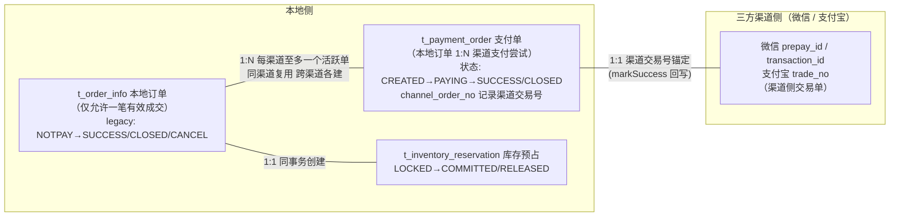
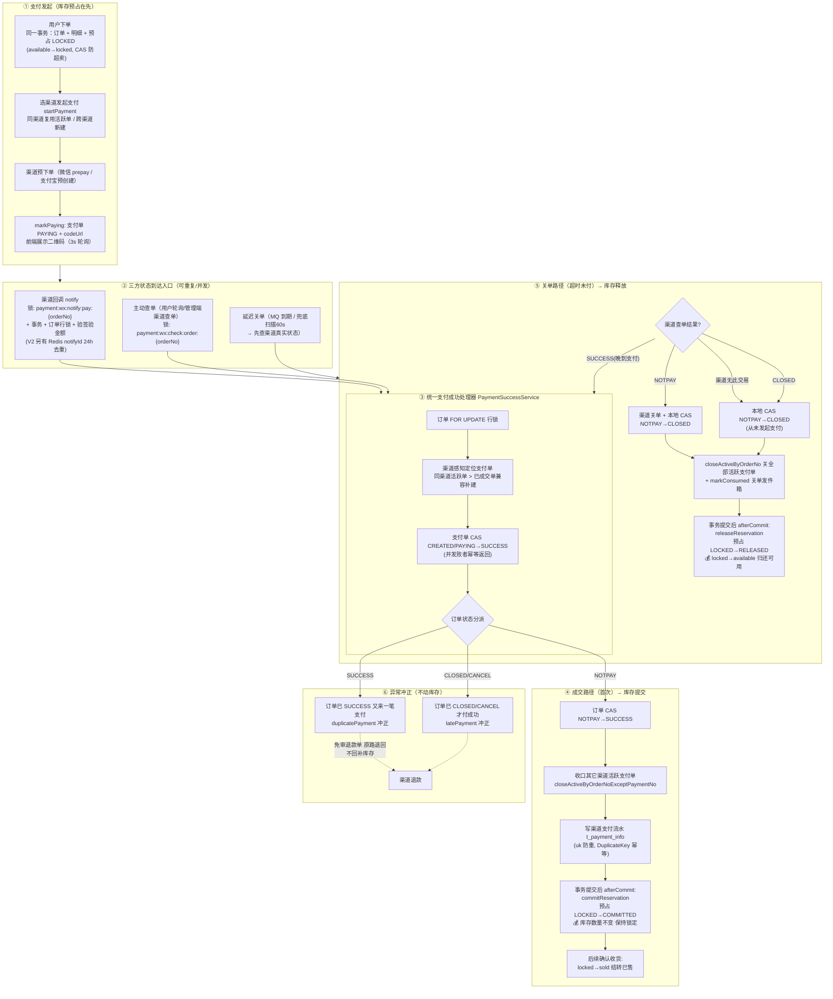
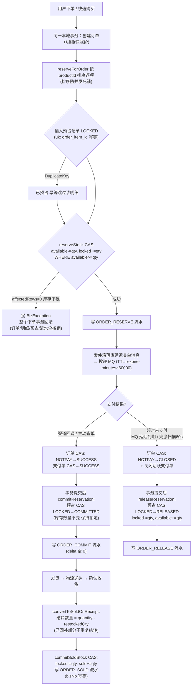
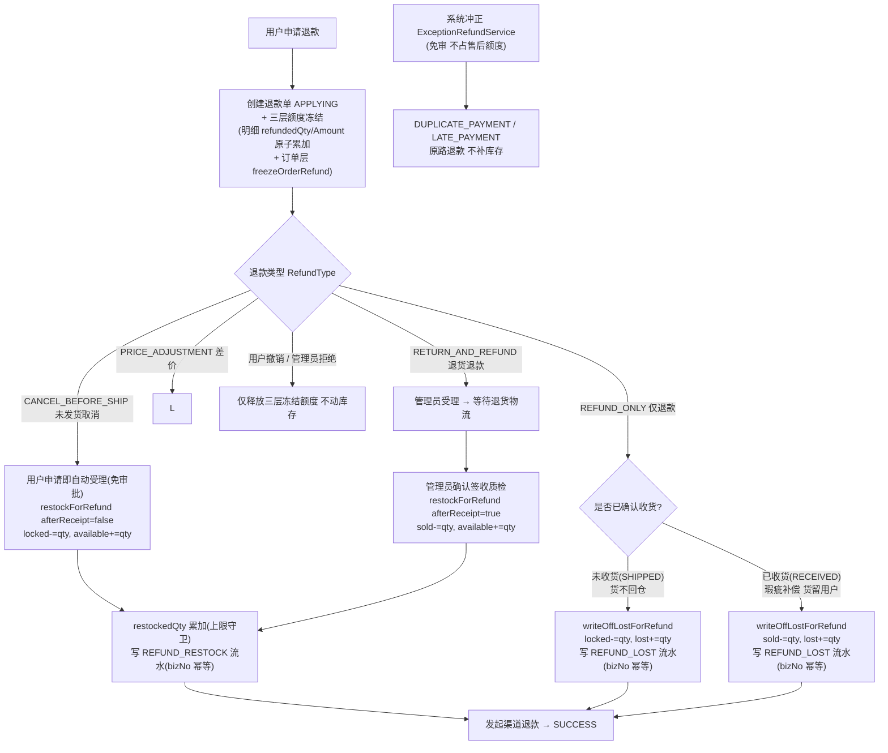

# CODE_INTRO — 电商商城平台代码导览

> 本文是后端与两端前端的架构/代码导览。快速启动与环境要求见 [README.md](README.md)。

## 1. 项目概述

电商商城平台是基于 Spring Boot 的电商商城系统，集成**微信支付 V2/V3** 与**支付宝**通道，覆盖购物车、下单、支付、发货物流、确认收货、分项退款、账单对账完整闭环，并实现三层并发控制、库存预占、登录防护与批量库存维护等企业级能力。

- **技术栈**：Spring Boot 2.3.7 + Java 1.8 + MyBatis-Plus 3.3.1
- **数据库**：达梦 DM8（DmJdbcDriver18 8.1.2.192）
- **中间件**：Redis（缓存 + Redisson 3.16.8 分布式锁）、RabbitMQ（延迟消息 + 本地消息表）
- **对象存储**：本地磁盘 或 MinIO（库存 Excel 导入文件，可配置切换）
- **前端**：2 个独立 React 工程（user-ui 用户商城 / admin-ui 管理后台）
- **API 文档**：Swagger 2.7.0（`/swagger-ui.html`）

## 2. 项目结构

```
mall/
├── backend/                          # 后端 Spring Boot 应用（cc.ivera:backend）
│   ├── src/main/java/cc/ivera/
│   │   ├── config/                   # 配置类（Redisson/MQ 拓扑/支付配置加载/Swagger/WebMvc/MyBatis-Plus）
│   │   ├── controller/               # 25 个 REST 控制器 + support/WxPayNotifyHandler
│   │   ├── service/                  # 28 个业务服务（含 wxpay/ bill/ refund/ logistics/ 子包）
│   │   ├── entity/                   # 实体（23 张表 + BaseEntity 公共基类）
│   │   ├── enums/                    # 状态机枚举（25 个，含 alipay/ bill/ wxpay/ 子包）
│   │   ├── mapper/                   # MyBatis-Plus Mapper 接口
│   │   ├── dto/                      # 请求 DTO（admin/auth/bill/cart/checkout/refund 分组）
│   │   ├── security/                 # AuthInterceptor、JwtTokenService、LoginGuardService、AuthContext
│   │   ├── mq/                       # RabbitMQ 消费者与消息体
│   │   ├── job/                      # 定时任务（关单/退款同步兜底、本地消息重投、模拟物流）
│   │   ├── lock/                     # DistributedLockTemplate（Redisson 实现模板）
│   │   ├── event/                    # 领域事件（退款额度释放/退款成功监听）
│   │   ├── exception/ handler/       # BizException/OversoldException + 全局异常处理
│   │   ├── domain/refund/            # RefundPolicy 退款额度核算
│   │   └── PaymentDemoApplication    # 启动类
│   ├── src/main/resources/
│   │   ├── mapper/                   # MyBatis XML（19 个）
│   │   └── application.yml           # 应用配置
│   ├── docs/                         # DM8 / RabbitMQ 运维手册
│   └── env/
│       ├── docker-compose.dm8.yml    # DM8 容器编排（5236 端口 + 健康检查 + dm8-data 卷）
│       └── sql/dm8/                  # 全量建表 + 种子数据 + 存量库升级脚本
├── user-ui/                          # 用户商城：React 18 + Vite + antd 5（dev :3000，移动 App 风格）
├── admin-ui/                         # 管理后台：React 18 + Vite + antd 5 + Luckysheet（dev :3002）
├── AGENTS.md                         # 项目规则（issue 分类/分支/spec 治理/DoD）
└── README.md
```

## 3. 核心架构

### 3.1 三层并发控制

| 层级 | 机制 | 说明 |
|------|------|------|
| 第一层 | 通知幂等检查（Redis + notifyId） | 防止重复处理支付/退款通知 |
| 第二层 | Redisson 分布式锁（看门狗自动续期） | 防止并发操作同一订单/账单日 |
| 第三层 | 数据库行锁 + CAS 状态更新（version/条件更新） | 最终一致性保障，冲突返回友好提示 |

### 3.2 认证与授权（security 包）

- **双 Token**：Access 30 分钟 + Refresh 7 天；401 时前端 single-flight 单飞刷新，避免并发重复刷新
- **AuthInterceptor**：由 `WebMvcAuthConfig` 注册，统一拦截 `/api/**` 校验 Token 并注入 `AuthContext`（ThreadLocal，请求完成后清理）；OPTIONS 预检直接放行
- **公开路径**：`/api/auth/login|register|refresh|password-reset-request`、含 `/notify` 的回调、GET `/api/product`、GET `/api/payment-app/list|channels|list-by-channel/*`、`/api/regions`
- **角色规则**：
  - `ROLE_ADMIN` 必需：`/api/auth/admin/**`、`/api/admin/**`、含 `/admin/` 的路径、退款 accept/reject、`/api/payment-app|payment-channel|payment-config|reconciliation|refund-info`
  - `ROLE_ADMIN` 禁入：`/api/cart`、`/api/checkout`（返回 403「管理员账号不支持购物车与下单操作」）
- **登录锁定 LoginGuardService**：连续 3 次密码错误，按「用户名 + IP」双维度各自计数并锁定 10 分钟（Redis key：`auth:login_fail/lock:*`）；滑动窗口计数，锁定期间不触达数据库；Redis 异常时 fail-open 不阻断登录
- **密码重置**：`t_password_reset_request` 记录用户找回申请；管理员受理生成随机密码（仅展示一次）或直接按 userId 重置，重置后旧 Token 全局失效并清除锁定

### 3.3 交易模型 V2

订单状态拆分为四条正交状态线（前端 `statusLabels.js` 统一文案）：

| 状态线 | 枚举 | 取值 |
|--------|------|------|
| 支付状态 | `PayStatus` | UNPAID / PAID |
| 生命周期 | `OrderLifecycleStatus` | WAIT_PAY / ACTIVE / CLOSED |
| 履约状态 | `FulfillmentStatus` | WAIT_SHIP / SHIPPED / RECEIVED / CANCELLED |
| 退款状态 | `OrderRefundStatus` | NONE / REFUNDING / PARTIAL_REFUNDED / FULL_REFUNDED |

- **t_order_info**：主订单（含 version 乐观锁、pay_status、四条状态线、收货地址快照）
- **t_order_item**：订单明细，**快照价**（下单时价格/标题固化，不受后续改价影响）
- **t_payment_info**：渠道支付记录（payer_total 分），双唯一约束防重（order_no+pay_type、transaction_id+pay_type）
- **主动查单**：用户端与管理端可主动向渠道查询支付状态并同步本地（`/api/admin/order/{orderNo}/channel-query` 等）

**本地订单与三方渠道单的单据关系**



支付单（`t_payment_order`）核心规则：

| 规则 | 实现 |
|------|------|
| 一个业务订单允许多次支付尝试 | 本地订单 1:N 支付单 |
| 每渠道至多一个活跃单 | `startPayment` 同渠道查活跃单复用；跨渠道新建（旧渠道单不提前关，扫旧码仍能正确落行） |
| 只允许一笔有效成交 | `markSuccess` CAS（CREATED/PAYING→SUCCESS）；成交后 `closeActiveByOrderNoExceptPaymentNo` 收口其它渠道活跃单 |
| 支付单过期窗口 | `expire_time = min(订单过期, now+2h)`；距订单过期不足 60s 拒绝发起 |

**支付处理与库存联动架构**



**库存动作与支付事件对应速查**

| 支付事件 | 本地动作 | 库存动作 | 数量变化 |
|----------|----------|----------|----------|
| 下单（支付发起前） | 订单+预占同事务 | 预占 LOCKED | `available -= qty, locked += qty` |
| 首次支付成功 | 订单→SUCCESS、成交支付单落定 | 预占 **LOCKED→COMMITTED** | **无变化**（保持锁定） |
| 超时关单/取消 | 订单→CLOSED、活跃支付单全关 | 预占 **LOCKED→RELEASED** | `locked -= qty, available += qty` |
| 确认收货 | 履约→RECEIVED | **COMMITTED→结转已售** | `locked -= qty, sold += qty` |
| 重复支付/晚到支付 | 冲正退款单（免审） | **无库存动作** | 不回补（货权未转移或已由首笔锁定） |

**要点**

- **库存动作全部挂在本地订单状态 CAS 之后**：`commitReservation`/`releaseReservation` 经 `afterCommit` 在订单事务提交后执行，订单状态推进与库存变更同生共死，不留中间态
- **关单前必查渠道真实状态**：MQ 延迟关单消费者不直接关本地单，而是先调渠道查单——渠道已付则走支付成功（避免「本地关了渠道付了」的资损），渠道无单/未付才执行渠道关单+本地关单（TTL = `payment.order.expire-minutes` × 60000，默认 3 分钟）+ 定时兜底扫描（60s）；强制关单幂等（已关闭直接返回成功）
- **渠道感知定位**：通知/查单携带渠道标识，按「订单号+渠道」定位支付单，跨渠道多次扫码不会把冲正锚到错误渠道
- **冲正不动库存是刻意设计**：重复支付的库存已由首笔成交锁定；晚到支付的库存已随关单归还——冲正只处理资金侧原路退回

### 3.4 库存预占模型（InventoryService）

库存操作**全部本地事务同步执行，不走 MQ**（见 `InventoryService` 接口注释）；幂等为五层防线（通知幂等 → 上游状态闸门 → 预占状态机 CAS → 数量条件 UPDATE → 唯一键兜底，见下方「幂等防线架构」）。

**四桶计数（t_product）+ 预占状态机（t_inventory_reservation）**

```
available_stock 可用 │ locked_stock 锁定 │ sold_stock 已售 │ lost_stock 丢失/货损
（恒等式：available + locked + sold + lost = 入库总量）

LOCKED ──支付成功CAS──→ COMMITTED（库存数量不变，保持锁定，待收货结转）
LOCKED ──关单/取消CAS──→ RELEASED（locked 归还 available）
```

**下单链路库存流程**



**退款链路库存流程（按类型 × 履约状态分流，回补/核销时点由 `RefundPolicy` §37 决定）**



**幂等防线架构（五层，重复/并发/重投安全）**

```mermaid
flowchart TB
    subgraph T["触发源（可重复 / 并发到达）"]
        direction LR
        T1["支付回调 notify<br/>渠道会重试推送"]
        T2["主动查单 / 渠道查单<br/>与回调并发"]
        T3["MQ 延迟关单<br/>+ 兜底扫描双触发<br/>+ Outbox 重投"]
        T4["用户/管理员操作<br/>重复点击 / 页面重放"]
    end

    T --> L1

    subgraph L1["第 1 层 · 通知幂等（Redis，仅回调路径）"]
        N1["notifyId 去重<br/>重复通知在入口即拦截，不触达库存域"]
    end

    L1 --> L2

    subgraph L2["第 2 层 · 上游状态闸门（业务动作只成功一次）"]
        direction LR
        G1["订单 CAS<br/>NOTPAY→SUCCESS<br/>NOTPAY→CLOSED"]
        G2["支付单 CAS<br/>CREATED/PAYING→SUCCESS"]
        G3["物流单 CAS<br/>DELIVERED→RECEIVED<br/>(仅物流送达后用户可确认)"]
        G4["退款单 FOR UPDATE 行锁<br/>+ 状态机校验 ensureApplying"]
    end

    L2 -->|"闸门通过才进入库存域"| L3

    subgraph L3["第 3 层 · 预占状态机 CAS（核心幂等闸）"]
        S1["casTransition<br/>UPDATE ... SET status=to<br/>WHERE order_no=? AND status=from<br/>LOCKED→COMMITTED / LOCKED→RELEASED<br/>并发只有一个赢家"]
        S2["败者状态复核（changed=0 分流）<br/>全部已目标态 → 幂等返回<br/>含对立态 → 抛错（成交不可释放等）<br/>无记录 → 告警放行（历史单）"]
    end

    L3 --> L4

    subgraph L4["第 4 层 · 数量变更条件 UPDATE（防负防超）"]
        direction LR
        Q1["reserveStock<br/>WHERE available≥qty"]
        Q2["releaseReservedStock<br/>WHERE locked≥qty"]
        Q3["commitSoldStock<br/>WHERE locked≥qty"]
        Q4["releaseSoldStock<br/>WHERE sold≥qty"]
        Q5["addRestockedQty<br/>WHERE restocked+qty<br/>≤ refunded+frozen"]
        Q6["writeOffLostStock<br/>locked-=qty, lost+=qty<br/>WHERE locked≥qty"]
    end

    L4 --> L5

    subgraph L5["第 5 层 · 唯一键兜底（DB 最终闸门）"]
        direction LR
        U1["uk_reservation_order_item<br/>(order_item_id)<br/>重复预占 DuplicateKey→跳过"]
        U2["uk_inventory_biz_no (biz_no)<br/>TYPE:单号:itemId<br/>重复流水 DuplicateKey→跳过留痕"]
    end

    subgraph TX["贯穿 · 事务原子性"]
        X1["@Transactional：库存操作与订单/退款状态变更同事务<br/>任一步失败整体回滚，不留中间态<br/>commit/release 经 afterCommit 在订单事务提交后执行"]
    end

    L5 -.-> TX
```



**各库存操作的幂等矩阵**

| 操作 | 前置闸门（第2层） | 自身幂等机制（第3/4/5层） | 重复/并发到达时 |
|------|------|------|------|
| `reserveForOrder` 下单预占 | 订单+明细同事务插入 | `uk(order_item_id)` 挡重复预占；`reserveStock` 条件 UPDATE 防超卖 | 重复预占按明细跳过；库存不足**整单回滚**（订单不产生） |
| `commitReservation` 支付提交 | 订单 CAS NOTPAY→SUCCESS；支付单 CAS | `casTransition(LOCKED→COMMITTED)` + 败者状态复核；流水 `biz_no` UK | 已 COMMITTED 幂等返回；遇 RELEASED 抛错；无记录放行（历史单） |
| `releaseReservation` 关单释放 | 订单 CAS NOTPAY→CLOSED + 关闭活跃支付单 | `casTransition(LOCKED→RELEASED)` + 败者状态复核；流水 UK | 已 RELEASED 幂等返回；遇 COMMITTED 抛错（已成交不可释放）；无记录放行 |
| `convertToSoldOnReceipt` 收货结转 | 物流 CAS DELIVERED→RECEIVED（仅物流送达后可确认收货） | `biz_no` 预检（ORDER_SOLD:orderNo:itemId）+ 结转数量 quantity-restockedQty + `commitSoldStock` 条件 UPDATE + 流水 UK | 已结转跳过；锁定不足仅告警不阻塞收货（旧模型兼容） |
| `restockForRefund` 退款回补 | 退款单行锁 + 状态机（受理/签收各一次） | `biz_no` 预检（REFUND_RESTOCK:refundNo:itemId）+ `addRestockedQty` 上限守卫 + 流水 UK | 已回补跳过；超「已退+冻结」上限抛错（防超补） |
| `writeOffLostForRefund` 仅退款货损核销 | 退款单行锁 + 受理状态机（REFUND_ONLY 未收货/已收货） | `biz_no` 预检（REFUND_LOST:refundNo:itemId）+ `addRestockedQty` 上限守卫 + `writeOffLostStock`/`writeOffSoldLostStock` 条件 UPDATE + 流水 UK | 已核销跳过；锁定/已售不足抛错；restockedQty 累加使收货结转自动跳过已核销数量 |
| `insertTransaction` 流水落库 | — | `uk(biz_no)` + DuplicateKeyException 捕获 | 重复流水跳过并留日志（审计终态兜底） |

**要点**

- **防超卖根闸门**：`ProductMapper.reserveStock` 条件 UPDATE（`WHERE available_stock >= qty`）；库存不足时**下单整体回滚**（订单不会产生），而非下单后扣减失败再退款
- **支付成功不动库存数量**：仅预占状态 LOCKED→COMMITTED，库存保持锁定；已售结转延迟到确认收货（`commitSoldStock`：locked→sold），为退款处理留出「未收货时库存仍在锁定桶」的通道
- **退款库存分三条路径**：① 未发货取消 / 退货退款签收 → **回补**（`restockForRefund`，未收货 locked→available、已收货签收 sold→available，货物回仓可再售）；② 仅退款（不退货）→ **核销货损**（`writeOffLostForRefund` 按履约状态分流：未收货 locked→lost、已收货 sold→lost，货物不回仓计入 lost_stock）；③ 差价 / 系统冲正 → **不动库存**（资金侧处理）
- **`biz_no` 是全链路幂等锚**：格式 `TYPE:orderNo/refundNo:itemId`，预检 selectCount + insert 时 UK 捕获双重防护，即使预检与插入之间存在并发窗口也被 UK 兜底
- **MQ 重投安全**：关单消费者与 Outbox 重投（`LocalMessageSendJob` 每 30s 重扫 PENDING）依赖上述幂等——消息重复投递不产生重复库存动作
- `t_inventory_transaction`：库存流水（bizType：ORDER_RESERVE/ORDER_COMMIT/ORDER_SOLD/ORDER_RELEASE/REFUND_RESTOCK/REFUND_LOST/MANUAL_ADJUST；operationStatus=FAILED 仅用于管理员手工调整申请被拒绝的留痕，库存不变）
- 重复支付/晚到支付冲正由 `PaymentSuccessService` 在支付成功链路自动触发；`OVER_SOLD` 熔断入口（`ExceptionRefundService.trigger`）为旧模型在途单兼容保留，当前交易链路无调用方

### 3.5 订单履约与退款

- **t_order_shipment**：发货单（运单号、发货时间、物流时间线），物流状态机 `SHIPPED → IN_TRANSIT → DELIVERED → RECEIVED`；`MockLogisticsProvider`（logistics 子包）+ `MockLogisticsSimulationJob` 定时模拟推进（发货后 20s 运输中、再 40s 送达，`logistics.mock.*-delay-ms` 可配）
- **收货地址**：`t_region`（三级行政区划，`RegionController` 公开级联查询）+ `t_shipping_address`（用户地址 CRUD，`UserAddressController`）；结算时选择地址并快照入订单
- 用户端：查看物流时间线；**确认收货仅物流 `DELIVERED` 后可操作**（订单列表 VO 透出 `shipmentStatus`，前端按此渲染按钮与「运输中/已送达」标签）；已付款未发货取消订单自动生成退款申请
- 管理端：模拟发货、强制关单、退款受理
- **退款单模型**（RefundOrder/RefundItem，区别于渠道退款记录 t_refund_info）：
  - 类型 `RefundType`（6 种）：未发货取消（受理后自动回补 locked→available）、退货退款（签收质检后回补 sold→available）、仅退款（核销货损：未收货 locked→lost、已收货 sold→lost）、差价退款（管理员发起手填金额，不动库存）、重复支付/晚到支付自动原路退款（`ExceptionRefundService` 系统冲正，不占售后额度）
  - 状态 `RefundOrderStatus`：APPLYING（待审核，可编辑/撤销）→ 受理后冻结额度 → 审核/退货签收 → 渠道退款 → SUCCESS/FAILED
  - **防超退**：受理即冻结可退额度，前端 `refundQuota.js` 与后端 `RefundPolicy` 双重核算；最后一件吃尾差，金额以服务端为准

### 3.6 支付配置体系

支付参数全部存数据库动态加载，支持管理后台页面维护（无需重启）：

- **t_payment_channel** — 支付渠道配置（WXPAY/ALIPAY），**商户参数内联在渠道表**：
  - 渠道公共参数 `config_params`（JSON：domain、gatewayUrl、contentKey、notifyUrl、returnUrl）
  - 微信列：appid、mch_id、mch_serial_no、**private_key（商户私钥 PEM 内容入库，替代 apiclient_key.pem 文件）**、api_v3_key、partner_key
  - 支付宝列：alipay_app_id、seller_id、merchant_private_key、alipay_public_key
  - 私钥文件配置体系已移除（`wxpay.properties` 等不再存在），该结构已固化在 `schema.sql` 全量脚本中
- **t_payment_app** — 渠道下应用配置（appName/appCode/channelId），订单绑定支付应用
- `PaymentConfigLoader` 启动加载并缓存；下单时从 `/api/payment-app` 加载启用应用；通知按订单绑定配置校验金额/商户号/appId；配置缓存可通过 `POST /api/payment-config/reload` 刷新

### 3.7 批量库存维护与 Excel 存储

- 管理后台「批量库存维护」页：上传 .xlsx（前端 SheetJS 解析）→ 生成 `t_stock_import` 导入记录（PENDING/IMPORTED，CAS 防重复确认）
- 点选记录 → 新路由 `/admin/stock-edit/:id` 打开全屏 Luckysheet 编辑器（UMD 脚本由 index.html 引入，隐藏公共头尾）核对/编辑保存 → 回列表确认入库
- 确认入库逐条独立原子事务（CAS 库存更新 + MANUAL_ADJUST 流水），失败行返回原因不影响成功行
- 库存流水分页接口支持商品/业务类型/状态过滤
- **文件存储抽象**：
  - `StockImportFileStore` 接口 + `LocalStockImportFileStore`（`stock.import.dir`）+ `MinioStockImportFileStore`（`stock.import.minio.*`，环境变量 `STOCK_IMPORT_MINIO_*` 覆盖）+ `StockImportFileStorage` 路由门面
  - `t_stock_import.storage_type/file_path` 按记录持久化后端与地址；读取按记录自身 storage_type 路由（null → LOCAL 兼容旧记录）

### 3.8 本地消息表（Outbox）

- `t_local_message`：关单/退款状态同步消息在业务事务内以 `PENDING` 落库 → 事务提交后投递 → broker 确认后标 `SENT` → 消费成功后回写 `CONSUMED`
- 投递失败指数退避重试（3^n 秒，最多 5 次），耗尽转 `FAILED` 人工补偿
- `LocalMessageSendJob` 每 30 秒重扫 `PENDING`；人工补偿：修复故障后将 `FAILED` 行置回 `PENDING` 并重置 `next_retry_time`（消费端幂等，重投安全）
- 发布端可靠性：publisher confirm（correlated）+ returns + mandatory；确认/退回失败由 `RabbitReliabilityConfig` 记日志（携带 orderNo/refundNo 关联），由 DB 兜底任务对账

### 3.9 对账架构（账单上传 + 同步对账）

对账采用「管理员下载微信交易账单 CSV → 页面上传 → 系统同步解析入库并对账」模式，不走 MQ、无定时调度。

#### 账单种类与解析（依据微信支付 v3《交易账单详细说明》）

`WxTradeBillParser`（无 Spring 依赖，可独立单测）按表头列名定位字段而非固定下标，自动识别种类：

| 种类 | 识别条件 | 内容 | 对账范围 |
|------|----------|------|----------|
| ALL | 表头含「微信退款单号」列 | 支付行 + 退款行 + 撤销行 | 支付 + 退款双向 |
| SUCCESS | 表头无退款相关列 | 仅支付成功行 | 仅支付方向 |
| REFUND | 表头含「退款申请时间」/「退款成功时间」列 | 仅退款行 | 仅退款方向 |

解析规则：
- 行类型由「交易状态」列判定：`SUCCESS`=支付行，`REFUND`=转入退款行，`REVOKED`=付款码撤销行
- 字段值前反引号 `` ` `` 前缀（防 Excel 科学计数法）解析时去除；金额元→分用 BigDecimal `movePointRight(2)`
- 表头/汇总行/首字段非交易时间行一律跳过；坏行计数跳过不中断整单
- BOM 清洗、双引号包裹与 `""` 转义兼容；撤销行无退款单号时回退原支付订单号

#### 数据模型（三表）

- **t_bill_import**：批次表。import_no（BILL+序号，UK）、channel_code、bill_kind（ALL/SUCCESS/REFUND）、bill_date、file_hash（SHA-256，UK）、笔数统计、status（IMPORTED/RECONCILED/FAILED）。唯一约束：uk(import_no)、uk(渠道,类型,日期,种类)、uk(file_hash)
- **t_bill_record**：流水表。record_type（PAY/REFUND）、channel_serial_no（支付=微信订单号/退款=微信退款单号，UK）、biz_no、金额（分）、交易时间、raw_line（CLOB 原始行）
- **t_bill_reconcile_discrepancy**：差异单表。biz_type、discrepancy_type（8 类）、双方金额/状态快照、status（OPEN/RESOLVED）、resolve_remark（必填）、resolved_by/time

#### 上传与对账流程

```
上传 CSV → 参数校验（非空/大小/历史日期）
  → SHA-256 hash 命中？→ 直接返回原批次（幂等）
  → 解析 CSV（识别 billKind）→ 账单日+种类互斥校验（锁外快速拒绝）
  → Redisson 锁 bill-reconcile:WXPAY:{billDate}
      ├─ 锁内二次检查
      ├─ 事务1：批次 + 流水入库
      └─ 事务2：对账（失败标 FAILED，批次保留可重跑）
  → 返回批次
```

- **支付核对**：账单 PAY 行 vs t_payment_info（order_no + WXPAY）：本地无→PAY_CHANNEL_ONLY；金额不符→PAY_AMOUNT_MISMATCH；本地非 SUCCESS→PAY_STATUS_MISMATCH；反向扫描账单日本地 SUCCESS 但账单无→PAY_LOCAL_ONLY
- **退款核对**：账单 REFUND 行 vs t_refund_info（refund_no）：同理四类，PROCESSING 中间态不判差异
- **重跑**：先按 import_id 删除旧差异单再重算，结果确定不重复
- **金额口径**：账单元→分 BigDecimal 精确转换；本地取 payer_total / refund（分），Integer 直接比较

## 4. 数据库实体（23 张业务表）

| 实体 | 表名 | 说明 |
|------|------|------|
| `PaymentChannel` | `t_payment_channel` | 支付渠道配置（商户参数内联，私钥入库） |
| `PaymentApp` | `t_payment_app` | 渠道下应用配置 |
| `Product` | `t_product` | 商品（价格分、库存、上下架状态） |
| `OrderInfo` | `t_order_info` | 主订单（version 乐观锁 + 四条状态线） |
| `OrderItem` | `t_order_item` | 订单明细（快照价） |
| `PaymentOrder` | `t_payment_order` | 支付单（渠道单号/支付单状态/渠道尝试记录） |
| `PaymentInfo` | `t_payment_info` | 渠道支付记录（payer_total 分，双唯一约束） |
| `OrderShipment` | `t_order_shipment` | 发货单（运单号/物流时间线） |
| `InventoryReservation` | `t_inventory_reservation` | 库存预占（LOCKED/COMMITTED/RELEASED） |
| `InventoryTransaction` | `t_inventory_transaction` | 库存流水（available/locked/sold/lost 四桶 delta，含 FAILED 记录） |
| `StockImport` | `t_stock_import` | Excel 导入记录（storage_type/file_path） |
| `RefundOrder` / `RefundItem` | `t_refund_order` / `t_refund_item` | 退款单/退款明细（冻结额度防超退） |
| `RefundInfo` | `t_refund_info` | 渠道退款记录（refund 分） |
| `UserAccount` | `t_user` | 用户账户（角色/禁用状态） |
| `PasswordResetRequest` | `t_password_reset_request` | 找回密码申请 |
| `ShippingAddress` | `t_shipping_address` | 收货地址 |
| `Region` | `t_region` | 三级行政区划 |
| `BillImport` | `t_bill_import` | 账单批次（hash/种类幂等） |
| `BillRecord` | `t_bill_record` | 账单流水（PAY/REFUND 行） |
| `BillReconcileDiscrepancy` | `t_bill_reconcile_discrepancy` | 对账差异（8 类 + 快照 + 处理记录） |
| `LocalMessage` | `t_local_message` | 本地消息表（Outbox：PENDING/SENT/CONSUMED/FAILED） |
| `BaseEntity` | — | 公共基类（id/createTime/updateTime） |

> 建表脚本：`schema.sql`（一体化全量脚本：21 张核心表 + 种子数据 + `t_region` 行政区划 + `t_shipping_address` 地址表，可重复执行；历次增量升级结构已全部固化其中）。

## 5. Controller 路由（25 个）

**商城端**

| Controller | 路径前缀 | 说明 |
|------------|----------|------|
| `AuthController` | `/api/auth` | 注册/登录/登出/双 Token 刷新/改密/找回密码申请 |
| `ProductController` | `/api/product` | 商品列表/详情（GET 公开） |
| `CartController` | `/api/cart` | Redis 购物车（管理员禁入） |
| `CheckoutController` | `/api/checkout` | 结算下单/订单查询/微信/支付宝下单（管理员禁入） |
| `OrderInfoController` | `/api/order-info` | 用户订单查询 |
| `OrderShipmentController` | `/api/order` | 物流时间线/确认收货/已付款未发货取消（转退款申请） |
| `RefundApplyController` | `/api/refund-applies` | 分项退款申请创建/编辑/撤销/我的列表 |
| `RefundApplicationController` | （方法级多路径） | 旧退款入口兼容（`/api/refund-info/apply` 等） |
| `RefundInfoController` | `/api/refund-info` | 渠道退款记录查询（管理员） |
| `WxPayController` | `/api/wx-pay` | 微信支付 V3（Native 扫码/退款/通知/查单/关单/账单下载） |
| `WxPayV2Controller` | `/api/wx-pay-v2` | 微信支付 V2（扫码/通知） |
| `AliPayController` | `/api/ali-pay` | 支付宝（表单跳转下单/退款/通知/账单） |
| `PaymentAppController` | `/api/payment-app` | 支付应用（公开列表/渠道维度查询 + 管理端 CRUD） |
| `PaymentChannelController` | `/api/payment-channel` | 支付渠道配置 CRUD（管理员） |
| `PaymentConfigController` | `/api/payment-config` | 配置缓存重载（管理员） |
| `RegionController` | `/api/regions` | 三级行政区划级联（公开） |
| `UserAddressController` | `/api/user/address` | 收货地址 CRUD |
| `TestController` | `/api/test` | 测试辅助接口 |

**管理端（仅 ROLE_ADMIN）**

| Controller | 路径前缀 | 说明 |
|------------|----------|------|
| `AdminUserController` | `/api/admin/users` | 用户分页/详情/禁用启用 |
| `AdminProductController` | `/api/admin/products` | 商品 CRUD/库存调整/批量调整/上下架 |
| `AdminOrderShipmentController` | `/api/admin/order` | 全部订单/待发货/发货/强制关单（幂等）/标记已付/渠道查单/支付单尝试记录 |
| `AdminRefundOrderController` | `/api/admin/refund` | 退款受理/拒绝/退货签收/渠道重试/状态查询/差价退款 |
| `StockAdminController` | `/api/admin/stock` | 库存操作日志/异常重放/流水分页/Excel 导入记录与确认 |
| `AdminPasswordResetRequestController` | `/api/admin/password-reset-requests` | 找回密码申请受理/拒绝 |
| `ReconciliationController` | `/api/reconciliation` | 账单上传/批次/流水/差异/重跑/标记处理 |

> `controller/support/WxPayNotifyHandler` 为微信 V3 通知验签/解密支撑组件，非独立路由。

## 6. Service 层要点

| Service | 说明 |
|---------|------|
| `AuthService` / `LoginGuardService` | 双 Token 认证、Token 版本校验、登录失败双维度计数与锁定 |
| `ProductService` / `ProductStockService` | 商品 CRUD、库存 CAS 调整 |
| `CartService` | Redis 购物车（实时价/库存） |
| `CheckoutService` | 多商品下单（快照价 + 收货地址 + 库存预占 + 支付单创建） |
| `OrderInfoService` | 订单状态机、关单幂等 |
| `PaymentOrderService` | 支付单状态与渠道尝试记录收口 |
| `PaymentSuccessService` | 支付成功统一处理（扣库存/状态推进/事件发布） |
| `InventoryService` | 预占 LOCKED→COMMITTED/RELEASED，CAS 防超卖 |
| `ShipmentService` + `logistics/MockLogisticsProvider` | 发货/物流时间线/确认收货/模拟物流推进 |
| `ShippingAddressService` | 收货地址管理 |
| `RefundOrderService` + `domain/refund/RefundPolicy` | 退款单状态机、额度冻结与防超退核算 |
| `RefundApplicationService` | 用户分项退款申请/编辑/撤销 |
| `refund/OrderRefundStatusService` | 订单级退款状态汇总推进 |
| `ExceptionRefundService` | 重复支付/晚到支付自动冲正退款 |
| `RefundStatusSyncMessageService` | 退款状态同步延迟消息（Outbox） |
| `OrderCloseMessageService` | 订单关闭延迟消息（Outbox） |
| `LocalMessageService` | 本地消息表投递/确认/重试/补偿 |
| `AliPayService` | 支付宝支付/退款/查单/关单/账单 |
| `wxpay/WxPayOrderFacade` / `WxPayRefundFacade` / `WxPayBillFacade` | 微信 V3 订单/退款/账单门面（impl/wxpay 下含 HttpClient 与通知解密） |
| `PaymentChannelService` / `PaymentAppService` + `config/PaymentConfigLoader` | 支付配置加载/缓存/维护 |
| `StockImportService` | Excel 导入记录/确认入库（CAS）/失败明细/文件存储路由 |
| `bill/BillReconcileService` | 账单上传对账（幂等/种类互斥/8 类差异） |
| `bill/parser/WxTradeBillParser` | 微信交易账单 CSV 解析（可独立单测） |
| `PasswordResetRequestService` | 找回密码申请受理/重置 |

## 7. MQ 与定时任务

### 队列拓扑（启动时由 Spring AMQP 声明，详见 backend/docs/RABBITMQ_OPERATIONS.md）

**订单延迟关单（OrderCloseRabbitConfig）**

| 类型 | 名称 | 说明 |
|------|------|------|
| exchange | `payment.order.close.event.exchange` | 生产者发布延迟关单消息 |
| exchange | `payment.order.close.dead-letter.exchange` | 接收过期消息 |
| queue | `payment.order.close.delay.queue` | 延迟队列，TTL = expire-minutes × 60000（改 TTL 需删队列重建） |
| queue | `payment.order.close.release.queue` | 消费队列（OrderCloseConsumer） |
| routing key | `payment.order.close.delay` / `payment.order.close.release` | — |

**退款状态同步（RefundStatusSyncRabbitConfig）**：`payment.refund.status-sync.*` 同构，TTL = `payment.refund.status-sync-delay-ms`。

### 可靠性策略

- 消费重试：指数退避 2s→6s→18s 共 4 次，耗尽拒绝且不回队（避免热重试），由 DB 兜底任务接管
- 发布可靠：publisher confirm + returns + mandatory，失败由 `RabbitReliabilityConfig` 记日志
- Outbox：见 3.8 节

### 定时任务

| 任务 | 周期 | 说明 |
|------|------|------|
| `TimeoutOrderCloseScheduler` | 60s | 超时未支付订单兜底关单（幂等） |
| `RefundStatusSyncScheduler` | 60s | PROCESSING 退款状态兜底同步（幂等） |
| `LocalMessageSendJob` | 30s | 重扫 PENDING 本地消息投递 |
| `MockLogisticsSimulationJob` | 定时 | 模拟物流状态推进（发货→运输→送达） |

> 对账不走 MQ：上传后同步解析入库并对账。

## 8. 前端工程

两工程均为 React 18 + Vite 5 + antd 5 + axios，react-router 6；axios baseURL 均为 `http://localhost:8080`（CORS 直连，无 Vite 代理）；401 时经 `refreshSingleFlight` 单飞刷新 Token。

### user-ui — 用户商城（dev :3000，HashRouter）

移动 App 风格界面（渐变顶栏 + 搜索药丸 + 卡片化布局，`taobao.css`/`mobile.css`/`theme.css`）。

| 页面 | 路由 | 说明 |
|------|------|------|
| `Home` | `/` | 商品列表、加购 |
| `Login` | `/login` | 登录/注册/忘记密码（品牌渐变 Hero + 悬浮白卡） |
| `Cart` | `/cart` | 购物车、选择收货地址、选择支付方式、结算下单 |
| `OrdersV2` | `/orders` | 订单列表、微信扫码弹窗（QRCodeSVG + 轮询）、支付宝跳转、主动查单、分项退款、取消/确认收货（仅物流送达后可点）、物流查看 |
| `RefundApplications` | `/refund-applications` | 退款申请列表、编辑/撤销（前端额度核算 `refundQuota.js`） |
| `Account` | `/account` | 用户中心、弹窗式修改密码、退出登录 |
| `Addresses` | `/addresses` | 收货地址管理（Cascader 三级区域） |
| `Success` | `/success` | 支付成功页 |

逻辑单测（`npm run test:logic`）：Token 单飞刷新。

### admin-ui — 管理后台（dev :3002，BrowserRouter）

「支付业务演示 · 管理后台」顶栏 + 左侧 12 项导航 + 右侧内容区；`RequireAuth`/`RequireAdmin` 双重路由守卫；登录态存 localStorage（`admin_` 前缀）；主题色 `--adm-primary: #1677FF`。

| 菜单 | 路由 | 页面能力 |
|------|------|----------|
| 订单管理 | `/admin/orders` | 多状态线筛选、详情抽屉、强制关单、标记已付、渠道查单、支付单尝试记录 |
| 订单发货 | `/admin/shipping` | 待发货列表、模拟发货 |
| 商品库存 | `/admin/products` | 商品 CRUD、库存调整（单个/批量）、上下架、详情抽屉 |
| 退款受理 | `/admin/refunds` | 退款列表、受理/拒绝/退货签收/渠道重试/状态查询/差价退款 |
| 用户列表 | `/admin/users` | 分页搜索、禁用启用、用户详情 |
| 密码重置申请 | `/admin/reset-requests` | 找回密码申请受理/拒绝 |
| 重置用户密码 | `/admin/reset-password` | 按用户直接重置（随机密码仅展示一次） |
| 批量库存维护 | `/admin/stock-maintenance` | Excel 导入、记录列表、确认入库 |
| （全屏编辑器） | `/admin/stock-edit/:id` | Luckysheet 全屏核对/编辑导入文件 |
| 下载账单 | `/admin/download` | 微信/支付宝账单下载跳转 |
| 支付配置 | `/admin/payment-config` | 渠道/应用配置维护（商户参数、私钥内容） |
| 对账管理 | `/admin/reconciliation` | 账单上传、批次/流水/差异查看、重跑、标记处理 |

逻辑单测（`npm run test:logic`）：Token 单飞刷新。

## 9. 配置要点（backend/src/main/resources/application.yml）

| 配置 | 说明 |
|------|------|
| `server.port` | 8080 |
| `spring.datasource.*` | DM8 连接（`jdbc:dm://${DM_HOST}:${DM_PORT}?schema=${DM_SCHEMA}`，环境变量 DM_HOST/DM_PORT/DM_SCHEMA/DM_USERNAME/DM_PASSWORD 覆盖） |
| `spring.redis.*` | Redis 连接（购物车/Token/锁定/幂等） |
| `spring.rabbitmq.*` | RabbitMQ 连接与可靠性（confirm/returns/listener retry） |
| `mybatis-plus.mapper-locations` | `classpath:mapper/*.xml`（19 个 XML） |
| `payment.auth.access-ttl-seconds` | Access Token TTL（默认 1800 = 30 分钟） |
| `payment.auth.refresh-ttl-seconds` | Refresh Token TTL（默认 604800 = 7 天） |
| `payment.auth.jwt-secret` | JWT 密钥（环境变量 `AUTH_JWT_SECRET` 覆盖） |
| `payment.order.expire-minutes` | 本地订单未支付超时（分钟，默认 3）：到时释放预占库存并关单；延迟关单 TTL = 该值 × 60000 |
| `payment.refund.status-sync-delay-ms` | 退款状态同步延迟（默认 60000） |
| `stock.import.storage` | Excel 存储后端：`local` / `minio` |
| `stock.import.dir` | local 模式保存目录 |
| `stock.import.minio.*` | minio 模式 endpoint/access-key/secret-key/bucket（`STOCK_IMPORT_MINIO_*` 环境变量覆盖） |

## 10. 治理与文档索引

- [AGENTS.md](AGENTS.md) — issue 分类、分支命名、测试要求、spec 治理与 DoD 规则
- `spec/` — 规格状态账本（变更前按规则创建：`spec/planned/<domain>/` → 实现后移入 `spec/implemented/`）
- [backend/docs/DAMENG_DM8_OPERATIONS.md](backend/docs/DAMENG_DM8_OPERATIONS.md) — DM8 启动/初始化/清库重建
- [backend/docs/RABBITMQ_OPERATIONS.md](backend/docs/RABBITMQ_OPERATIONS.md) — 队列拓扑、可靠性策略、冒烟测试与回滚说明

变更代码前必须先找到/创建对应 spec；实现、测试、文档与 spec 不一致即视为未完成。
